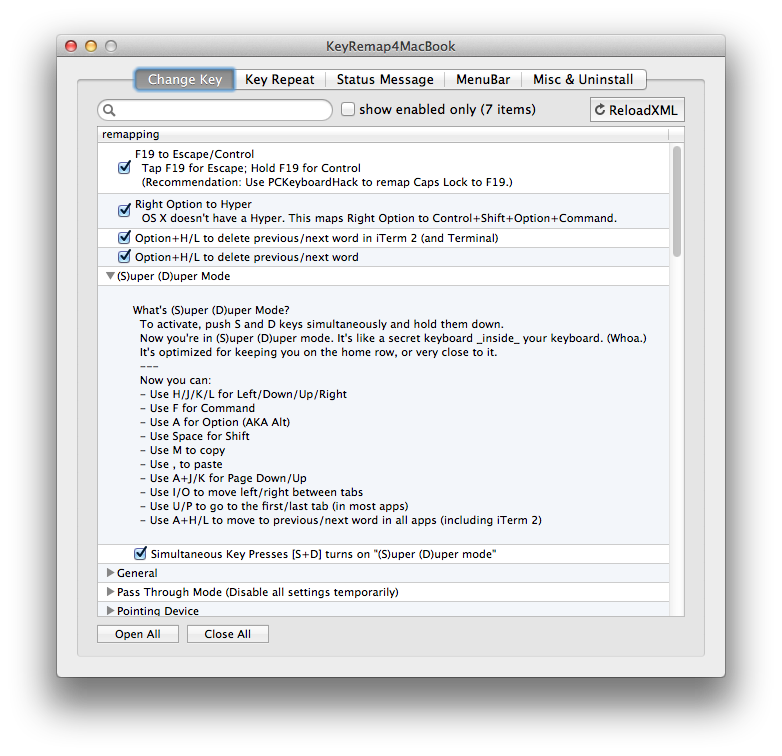

## Toward a more useful keyboard

Steve Losh's [Modern Space Cadet][modern-space-cadet] is an inspiration.
It opened my eyes to the fact that there's a more useful keyboard hidden inside the vanilla QWERTY package that most of us have tolerated for all these years.
This repo represents my nascent quest to unleash that more useful keyboard.

At first, this might sound no different than the typical Emacs/Vim/\<Every-Other-Editor> tweakfest.
But it is.
I'm not talking about honing my editor-of-choice.
I'm not talking about pimping out my shell.
I want a more useful keyboard _everywhere_.
Whether I'm in my editor, in the terminal, in the browser, or in Keynote,
I want a more useful keyboard.

And ideally, I want the _same_ (more useful) keyboard in every app.
Ubiquitous keyboarding.
Muscle memory.
[Don't make me think][don't-make-me-think].

How do I go to the beginning of the line in this app?
The same way I go to the beginning of the line in _every_ app!
Don't make me think.

How do I go to the top of the file/screen/page in this app?
The same way I...
Well, you get the point.

## Some assembly required

In its current state, my more-useful keyboard is built on top of a few tools, and some custom keymappings for those tools (all of which are described below).
Where possible, this repo houses the configuration files that power my more-useful keyboard.
In the places where the customization requires manual steps, I describe those steps.

Below you'll find a step-by-step guide for building this more-useful keyboard from scratch.

## More useful (for me)

> **cus·tom·ize** (_verb_): to modify or build according to individual or personal specifications or preference [[dictionary.com][customize]]

Any customization is, by definition, personal.
While I find that these customizations yield a more-useful keyboard for me, they might not feel like a win for you.

These customizations currently provide a fraction of what I want from my more-useful keyboard.
I find it to be a very useful fraction, but I don't consider it complete by any means.

Here's what it provides so far:



## Dependencies

This setup is honed and tested with the following dependencies.

- OS X 10.8 (Mountain Lion)
- [PCKeyboardHack 9.0][pckeyboardhack]
- [KeyRemap4MacBook 8.0][keyremap4macbook]

## The Setup

### Grab the bits

```sh
git clone https://github.com/jasonrudolph/keyboard.git

cd keyboard

mkdir -p ~/Library/Application\ Support/KeyRemap4MacBook

# Prepare custom settings for KeyRemap4MacBook
ln -s $PWD/keyremap4macbook/private.xml \
  ~/Library/Application\ Support/KeyRemap4MacBook/private.xml
```

### Install the apps

- Install [PCKeyboardHack][pckeyboardhack]
- Install [KeyRemap4MacBook][keyremap4macbook]

### Put _control_ and _escape_ on the home row

#### Goals

- Tap **caps lock** for **escape**
- Hold **caps lock** for **control**

#### Making it happen

1. Launch PCKeyboardHack.
2. Enable the "Change Caps Lock" option, and map **caps lock** to keycode 80.
   (80 is **F19**. I don't have a physical **F19** key, so this setting will not
   conflict with any existing keys.)
   [[screenshot][pckeyboardhack-screenshot]]
3. Launch KeyRemap4MacBook.
4. In the "Change Key" tab, enable the "F19 to Escape/Control" option.
   [[screenshot][keyremap4macbook-change-key-screenshot]]
5. In the "Key Repeat" tab, change the "[Key Overlaid Modifier] Timeout" to
   300ms. (As [recommended][modern-space-cadet-key-repeat] by Steve Losh, I find
   that this avoids accidentally triggering **escape** when you meant to trigger
   **control**.)
   [[screenshot][keyremap4macbook-key-repeat-screenshot]]

### Unleash (S)uper (D)uper mode

#### Goals

- Enable navigation (up/down/left/right) via the home row
- Enable word navigation (option+left/right) via the home row
- Enable other commonly-used actions on or near the home row

#### Making it happen

1. Launch KeyRemap4MacBook.
2. In the "Change Key" tab, enable the "(S)uper (D)uper Mode" option.
   [[screenshot][keyremap4macbook-change-key-screenshot]]

## TODO

- Document usage of "Hyper" key
- Incorporate [Keyboard Maestro][keyboard-maestro] configuration
- Describe `.inputrc` settings that enable standard forward/backward word navigation in Bash shell in iTerm2
- Automate with [Boxen][boxen]


[boxen]: http://boxen.github.com/
[customize]: http://dictionary.reference.com/browse/customize
[don't-make-me-think]: http://en.wikipedia.org/wiki/Don't_Make_Me_Think
[keyboard-maestro]: http://keyboardmaestro.com
[keyremap4macbook]: http://pqrs.org/macosx/keyremap4macbook/
[keyremap4macbook-change-key-screenshot]: screenshots/keyremap4macbook-change-key-config.png
[keyremap4macbook-key-repeat-screenshot]: screenshots/keyremap4macbook-key-repeat-config.png
[modern-space-cadet]: http://stevelosh.com/blog/2012/10/a-modern-space-cadet
[modern-space-cadet-key-repeat]: http://stevelosh.com/blog/2012/10/a-modern-space-cadet/#controlescape
[pckeyboardhack]: http://pqrs.org/macosx/keyremap4macbook/pckeyboardhack.html.en
[pckeyboardhack-screenshot]: screenshots/pckeyboardhack-config.png
